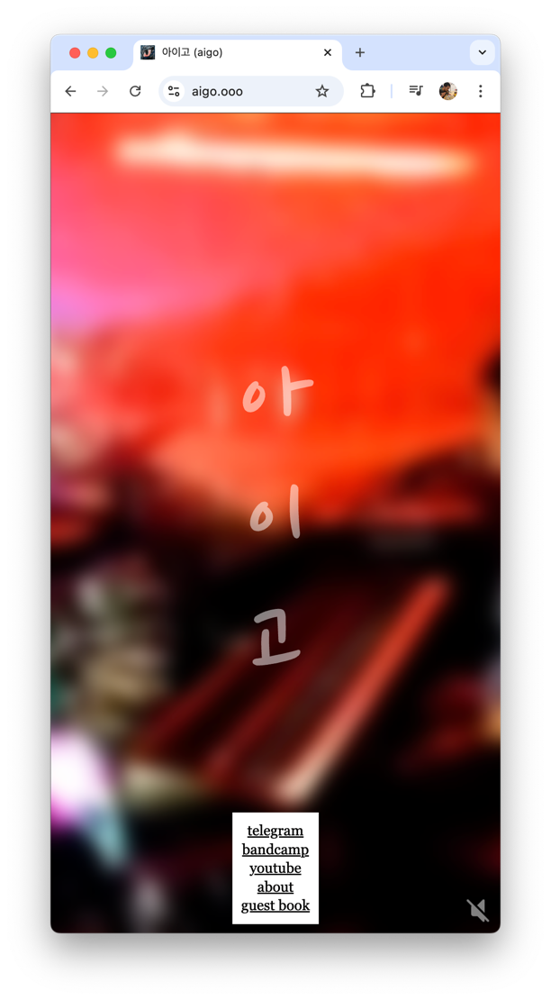

# `aigo.ooo`

this is a handmade website, for my friends aigo

this website came to be because i had the image in my head of the band name changing orientation with the aspect ratio.
a few minutes later, it was ready to go live.

## todo

- [ ] make the website usable without javascript
  - about and guestbook should be radios, with one big radio behind it to close their respective menus
- [ ] make the menu more mobile friendly
